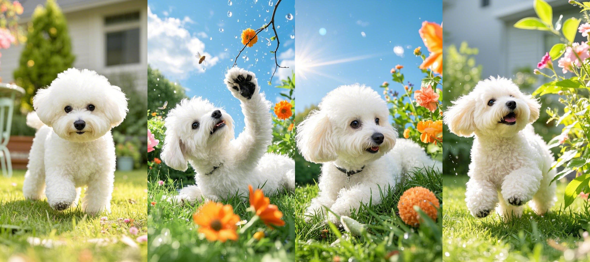
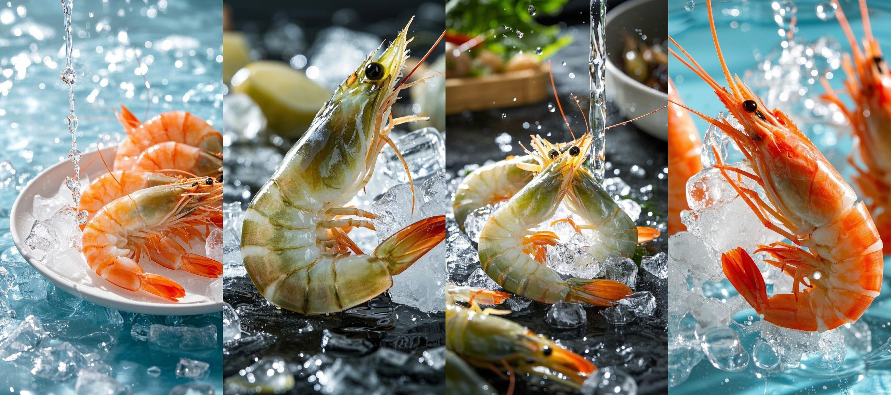
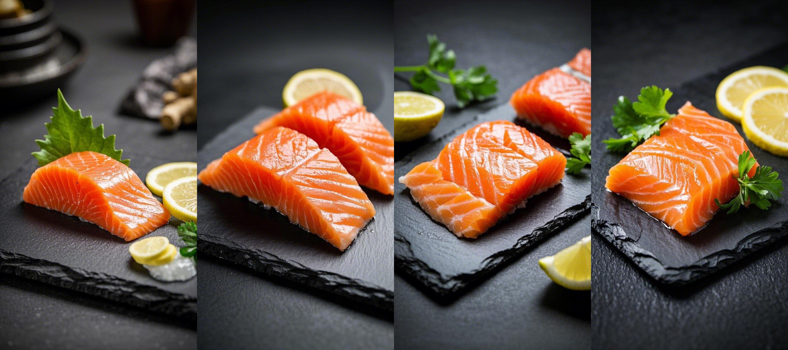
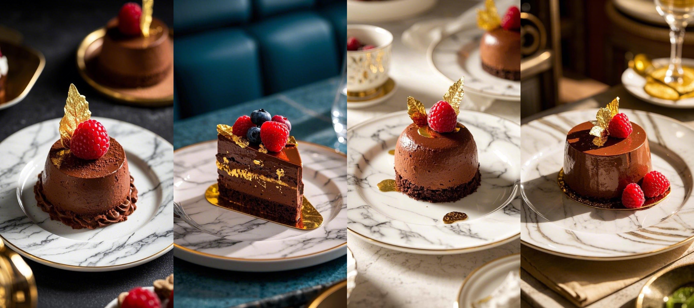
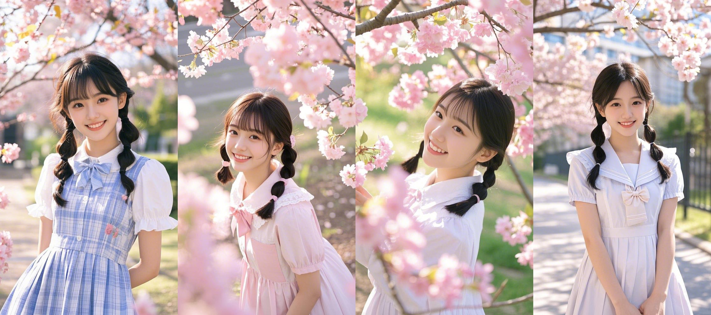
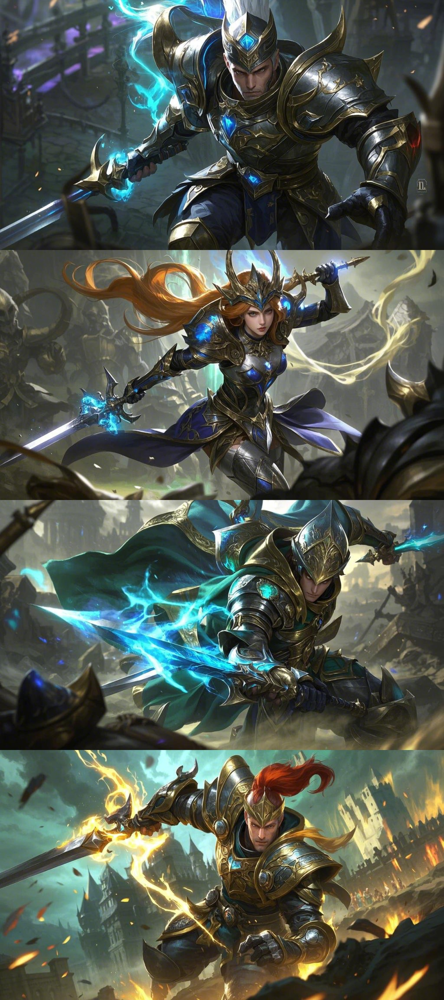
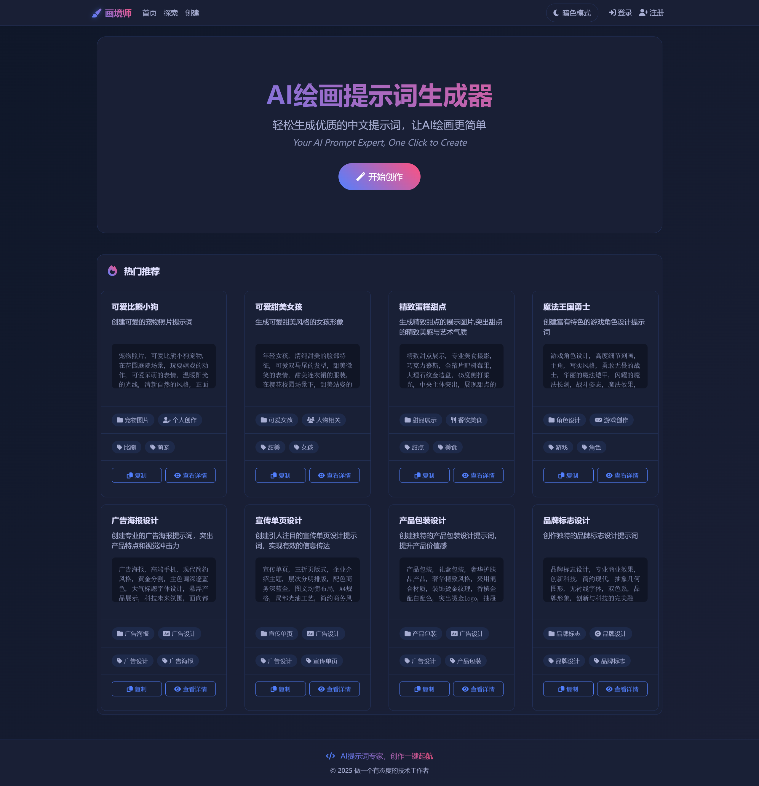
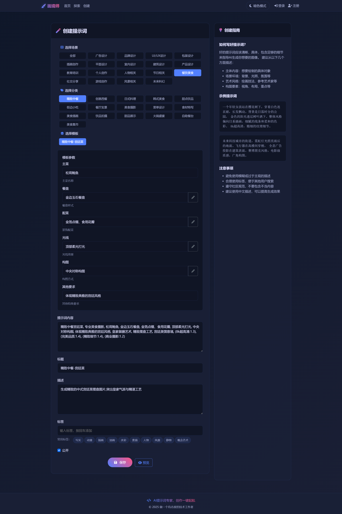
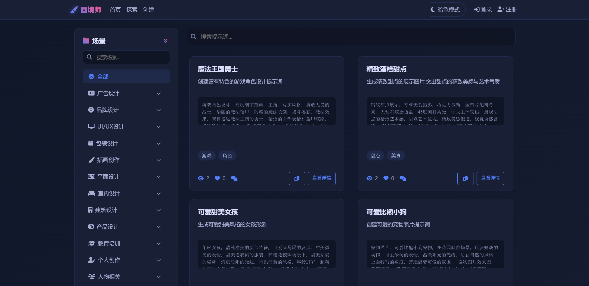
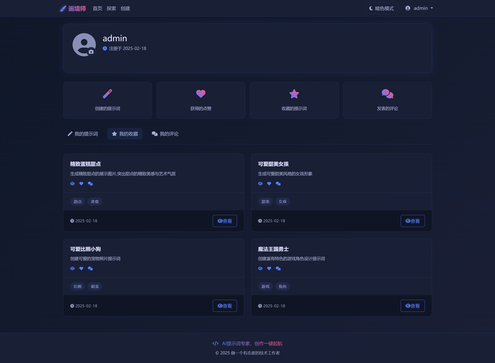

<h1 align="center">欢迎使用&nbsp;&nbsp;画境师 👋</h1>

  
  

> AI绘画提示词生成器，中文提示词工具，AI绘画咒语生成，AI作画提示词助手，设计师AI工具，提示词优化器，Midjourney中文提示词，AI绘画教程，智能提示词生成，提示词模板库，AI艺术创作助手，设计师绘画工具，AI作画神器，提示词转换工具，新媒体配图工具，电商主图生成器，商业设计AI助手，插画生成工具，概念设计辅助，人物肖像生成器，AI场景设计，室内设计AI工具，产品渲染助手，游戏原画生成，漫画风格生成器，角色设计工具，写实风格AI画图，风景图生成器，表情包制作工具，头像设计助手，美食摄影生成，建筑设计辅助，海报设计工具，Logo效果图生成，UI设计助手，AI Prompt Generator，Midjourney Helper，Stable Diffusion Assistant，AI Art Creator，Prompt Engineering Tool，Design AI Assistant，Art Prompt System，AI Drawing Guide，Professional Prompt Tool，Creative AI Assistant，Character Design AI，Scene Generator，Digital Art Assistant，Product Visualization AI，Commercial Design Tool🔮🤖🚀

## 🏠 [Homepage](https://github.com/pen9un/art-prompt-system)

画境师（Art Prompt System）是一个专业的AI绘画提示词生成与优化工具，专注于解决设计师和创作者在AI绘画过程中遇到的各种问题。它就像是一位经验丰富的AI绘画导师，帮助你准确表达创作意图，提升作品质量。在AI绘画的世界里，优质的提示词就像是画笔，而画境师则是为你调制颜料的助手。

## 🚀 使用说明

**微信交流群**（进群获取系统地址，系统使用完全免费，进群可体验高智能机器人，一键AI绘画。如群二维码失效请加微信 **OceanYoo** ，需备注 **画境师**）：

## 绘画示例

### 可爱萌宠

**提示词：**宠物照片, 可爱比熊小狗宠物, 在花园庭院场景, 玩耍嬉戏的动作, 可爱呆萌的表情, 温暖阳光的光线, 清新自然的风格, 正面特写的角度, 营造温馨可爱的氛围,  宠物图片效果图, 萌趣可爱, (8k超高清:1.3), (最佳品质:1.4), (完美细节:1.3), (精致渲染:1.2)

### 餐饮美食

**提示词：**食材特写摄影, 专业美食摄影, 大虾, 新鲜活虾晶莹剔透, 碎冰水滴晶莹, 45度侧打质感光, 微距特写构图, 突出食材的新鲜质感, 新鲜质感展现, 食材本味呈现, 视觉诱惑营造, (8k超高清:1.3), (完美品质:1.4), (精致细节:1.4), (商业摄影:1.2)

**提示词：**美食食材摄影, 专业美食摄影, 三文鱼刺身, 油亮剔透、纹理清晰, 磨砂黑石板配柠檬, 45度侧打光突出质感, 特写微距构图, 突出食材的质感美学, 食材质地展现, 纹理细节刻画, 视觉美感塑造, (8k超高清:1.3), (完美品质:1.4), (精致细节:1.4), (商业摄影:1.2)

**提示词：**精致甜点展示, 专业美食摄影, 巧克力慕斯, 金箔片配树莓果, 大理石纹金边盘, 45度侧打柔光, 中央主体突出, 展现甜点的精致艺术感, 甜点艺术呈现, 精致美感塑造, 视觉诱惑营造, (8k超高清:1.3), (完美品质:1.4), (精致细节:1.4), (商业摄影:1.2)

### 甜美女孩

**提示词：**画年轻女孩, 清纯甜美的脸部特征, 可爱双马尾的发型, 甜美微笑的表情, 甜美连衣裙的服装, 在樱花校园场景下, 甜美站姿的姿势, 清晨暖阳的光线, 日系清新的风格, 年龄17岁, 超精致可爱女孩肖像, (8k超高清:1.3), (最佳品质:1.4), (完美细节:1.3), (精致渲染:1.2)

### 游戏角色

**提示词：**画游戏角色设计, 高度细节刻画, 主角, 写实风格, 勇敢无畏的战士, 华丽的魔法铠甲, 闪耀的魔法长剑, 战斗姿态, 魔法效果, 来自遥远魔法王国的勇士, 精致的面部表情和盔甲纹路, 戏剧性的打光效果, (8k超高清:1.3), (最佳品质:1.4), (完美细节:1.3), (精致渲染:1.2)

## 遇见画境师

画境师，AI提示词专家，创作一键起航。

## 设计师的痛点

相信很多设计师和AI绘画爱好者都有这样的困扰：

- 不知道如何准确描述想要的画面效果
- 英文提示词组织困难，语法不够地道
- 缺乏专业的艺术描述词汇
- 生成效果与预期差距较大
- 优质提示词经验难以沉淀

## 谁在使用画境师？

画境师欢迎所有对AI绘画感兴趣的创作者：

### 设计行业
- 平面设计师：海报、广告、品牌设计
- UI设计师：界面设计、图标、Banner
- 产品设计师：产品效果图、渲染图
- 空间设计师：室内设计、建筑设计

### 内容创作者
- 新媒体运营：公众号配图、社媒素材
- 自媒体博主：视频封面、头像设计
- 电商从业者：产品主图、详情页设计
- 营销策划：活动海报、营销物料

### 行业从业者
- 餐饮从业者：菜品展示、店铺设计
- 教育工作者：教学素材、课件插图
- 地产从业者：房产展示、环境设计
- 旅游从业者：景点展示、旅游物料

### AI 绘画爱好者
- 个人创作者：个性化创作、艺术探索
- 绘画学习者：技法练习、风格研究
- 艺术爱好者：收藏创作、艺术欣赏
- 兴趣探索者：休闲娱乐、创意表达

## 核心功能

### 1. 智能提示词生成器

- 中文输入，智能转换
- 专业规则优化
- 一键优化功能
- 多场景模板支持

### 2. 专业模板系统

系统内置海量场景模板，是提示词生成的核心引擎：
- 丰富的场景模板库（商业设计、艺术创作、创意设计等）
- 每个模板都提供多个可自定义参数
  * 画面风格（写实、插画、水彩等）
  * 构图方式（特写、全景、侧视等）
  * 光线氛围（自然光、暖色调、冷色调等）
  * 细节程度（简约、精细、写实等）
  * 艺术风格（现代、复古、未来等）
- 参数组合灵活，适应不同创作需求
- 支持自定义模板，打造专属提示词

### 3. 智能推荐系统

- 基于使用习惯的个性化推荐
- 相似提示词推荐
- 热门提示词展示
- 场景化推荐

## 全面的场景覆盖

画境师提供丰富多样的场景模板和提示词库，覆盖各类创作需求：

### 商业创作
- 产品展示：电商主图、详情页、场景图、产品渲染
- 品牌设计：Logo效果图、VI展示、包装设计、品牌形象
- 广告创意：社媒广告、营销海报、活动主视觉、推广物料
- 空间设计：室内效果图、建筑表现、景观设计、商业空间

### 餐饮美食
- 菜品展示：美食摄影风格、创意菜品、饮品展示
- 店铺设计：餐厅空间、主题装饰、氛围营造
- 菜单设计：菜品图片、美食排版、创意呈现
- 节日活动：节日主题、促销活动、季节特饮

### 艺术创作
- 人物角色：肖像、全身像、动作设计、表情设计
- 场景概念：自然风光、都市空间、奇幻世界、科幻场景
- 插画设计：儿童插画、商业插画、游戏原画、漫画风格
- 概念设计：角色设计、道具设计、服装设计、场景设定

### 教育培训
- 教材插图：教科书配图、知识图解、示意图
- 课件设计：PPT配图、教学海报、培训材料
- 儿童教育：儿童插画、启蒙教具、互动场景
- 知识科普：科普插图、流程图解、信息图表

### 内容创作
- 自媒体：公众号配图、视频封面、头像设计、栏目主图
- 社交媒体：朋友圈配图、微博配图、表情包、动态图片
- 个人创作：个性头像、壁纸、装饰画、艺术照片
- 节日主题：新年、圣诞、节气、节庆活动

### 地产家居
- 房产展示：户型效果图、样板间、园林景观
- 家居设计：家具展示、软装搭配、空间布局
- 建筑设计：建筑外观、公共空间、城市规划
- 装修效果：装修前后、局部细节、材质展示

## 特色功能

### 个人中心

- 提示词收藏夹
- 历史记录查看
- 个性化设置
- 作品管理

### 社区互动

- 优质提示词分享
- 模板交流
- 作品展示
- 经验分享

### 暗亮主题

系统支持炫酷的暗色主题和亮色主题，顶部菜单一键切换。

## 使用步骤

1. 选择适合的场景模板
2. 根据需要微调参数
3. 获取优化后的提示词
5. 应用到AI绘画工具

## 为什么选择画境师？

- 专业的提示词优化规则
- 海量模板与灵活参数设置
- 持续更新的提示词库
- 活跃的创作者社区
- 便捷的使用体验

## 使用说明

画境师是一个完全免费的AI绘画提示词生成平台，致力于为所有创作者提供优质的创作支持。

### 游客模式
无需注册，即可体验所有功能：
- 浏览全部场景模板
- 查看用户公开的优质提示词
- 使用提示词生成功能
- 体验一键优化功能

### 注册用户
注册后即可使用完整功能：
- 创建个性化提示词
- 收藏优质提示词
- 保存历史记录
- 参与社区互动
- 分享创作经验

## 版本说明

### 当前版本 (1.0)
画境师目前专注于提供高质量的AI绘画提示词生成服务。生成的提示词需要配合其他AI绘画平台（如Midjourney、Stable Diffusion等）使用，以实现最终的绘画效果。

### 未来规划 (2.0)
正在开发画境师2.0版本，将为用户带来更便捷的创作体验：
- 一键AI绘画功能
- 提示词到作品的无缝衔接
- 更多令人期待的新功能

敬请期待！

## 📖更新日志

- 2025-02-18 系统开发完毕并上线
- 2025-02-13 系统诞生

## 🤝作者

👤 **pen9un**

* Website: https://github.com/pen9un/
* Github: [@pen9un](https://github.com/pen9un)

## ❤️支持

如果觉得此项目有用，请点一个免费的小 ⭐️⭐️

## ✨Star History

## 💹 访问量统计

